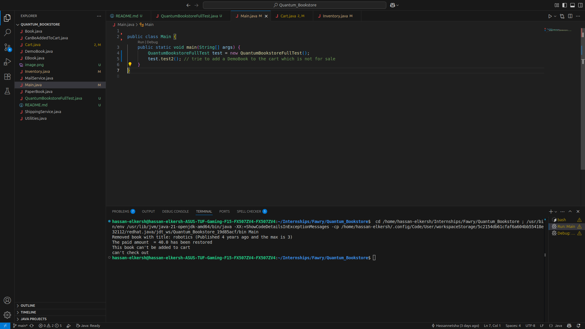

# Quantum Bookstore

Quantum Bookstore is a simple object-oriented Java-based application simulating an online bookstore that supports multiple types of books (paper, digital, demo), with extensibility and testability in mind.

---

## Features

- Support for three types of books:
  - **Paper Books** – Have a stock quantity and can be shipped.
  - **EBooks** – Have a file type and are sent via email.
  - **Showcase Books** – Demo books that are not for sale.
- Add books to the inventory using essential details: ISBN, title, year, author, and price.
- Remove outdated books based on a provided maximum age.
- Purchase books via ISBN and quantity with email/address inputs.
- Automatic validation and error handling for:
  - Unavailable or insufficient stock
  - Invalid book types for sale
- Output is prefixed with `Quantum book store` for every print statement.
- Easily extensible to support new book types or digital/physical media in the future.

---

## System Design

- **Base Class:** `Book` – Holds shared attributes like ISBN, title, author, publication year, price.
- **Subclasses:**
  - `PaperBook`
  - `EBook`
  - `ShowcaseBook`
- **Inventory Management:** A class that maintains a list of all books and handles addition, removal, and purchase logic.
- **Service Stubs:**
  - `ShippingService` – Simulates physical shipment which are not implemented as requested.
  - `MailService` – Simulates digital delivery which are not implemented as requested.
- **Testing:** All features can be tested using the `QuantumBookstoreFullTest` class.

## screenshots

